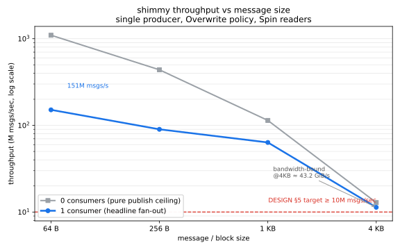
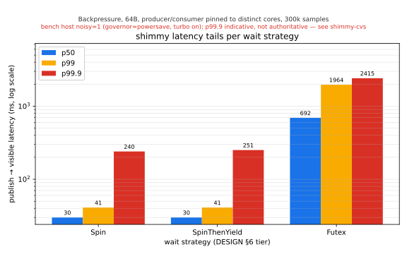

# shimmy

[](https://github.com/dpoage/shimmy/actions/workflows/ci.yml)

**One producer, many consumers, one machine — and as much throughput as the
memory bus will give you, with a latency tail you can actually name.** shimmy is
a header-only C++20 library for fanning a single producer out to many consumers
over shared memory on a single Linux host. It is built for the case where you
have a firehose of mostly-small messages and a handful of readers that all need
to see them *now*: telemetry, market-data fan-out, frame pipelines, that kind of
thing.

The whole project runs on one rule: **speculation is useless, data doesn't
lie.** Every number below was produced by a benchmark in `bench/`, run on real
hardware this session, and the charts are regenerated from the committed CSVs by
a script — never hand-drawn. Where the measurement is noisy, this README says so
out loud.

---

## The throughput story

The design target (DESIGN §5) is a deliberately honest one: **≥ 10M msgs/sec**
for a single producer at 64-byte messages, leaving real headroom rather than
chasing a number that forces tiny blocks and aggressive batching. The question
was never "can we hit 10M" — it was "how much room is actually there?"



The blue line is the headline: a single producer fanning out to **one** consumer
draining concurrently. At 64B it lands at **151 M msgs/sec** — about 15× the
target — and the gate is met across the entire size sweep. The grey line is the
pure publish ceiling (no readers attached): **~1.10 billion msgs/sec** at 64B,
which is what the producer's hot path can do when it isn't sharing cache lines
with anyone.

The two lines tell the real story together. The gap between them *is* the cost
of fan-out — the producer's stores being pulled into a reader's cache. And the
way both lines bend downward at the right edge is the point where shimmy stops
being message-rate-bound and becomes **bandwidth-bound**: at 4KB blocks the ring
is moving on the order of tens of GiB/s and the message rate collapses toward the
memory bus, exactly as a fixed-block design should. Small messages are
rate-limited by per-message work; big ones by raw bandwidth. The chart shows the
crossover instead of asserting it.

(The full sweep — 64B/256B/1KB/4KB × 0/1/2/4 consumers — lives in
[`bench/baselines/throughput.csv`](bench/baselines/throughput.csv).)

---

## The latency story

throughput is the easy half. The hard, honest half is the tail. shimmy refuses
to quote a single latency ceiling, because the right ceiling depends on how a
consumer chooses to *wait*. So each wait strategy is its own tier (DESIGN §6),
benched against its own implementation:

| Wait strategy | What it does | p99.9 hypothesis |
|---|---|---|
| `Spin` | busy-spin, no syscalls; burns a core for the tightest tail | < 200 ns |
| `SpinThenYield` | spin briefly, then `sched_yield`; robust default | < 1 µs |
| `Futex` | block on a futex; CPU-friendly under oversubscription | < 10 µs |



The median path is exactly what the design predicts and is rock-solid run to
run: `Spin` and `SpinThenYield` sit at **~30 ns p50 / ~41 ns p99**, and `Futex`
pays its wakeup cost at **~700 ns p50**, well inside its 10µs budget even at
p99.9 (**2 415 ns** measured). On this run two of the three p99.9 tiers come in
*under* their hypotheses and `Spin` lands at **240 ns** against a 200 ns target —
close, and the kind of result you only trust on a quiet machine.

And this machine is not quiet — which is the part the project insists on being
honest about. The bench host runs with turbo on and a cpufreq governor that
doesn't read `performance`, so the harness's noise detector stamps **`noisy=1`**
on every row (see the caveat baked directly into the chart above). The
implication is specific: **p50/p90/p99 are trustworthy, p99.9 is indicative, and
p99.99 still swings 10×+ run-to-run** — that swing is host jitter, not the ring.
"We measure honestly even when the machine is noisy" is the whole ethos, so the
authoritative turbo-off, core-isolated re-measure is tracked as an open task
(`shimmy-cvs`) rather than quietly papered over. Treat p99.9+ as indicative
until then.

(Per-strategy data: [`bench/baselines/latency.csv`](bench/baselines/latency.csv).)

### Bench host

- **CPU:** AMD Ryzen AI 9 HX 370 (12c/24t, single NUMA node, x86-64)
- **Power:** `amd_pstate=active`, EPP=`performance` — but governor string still
  reads `powersave` and boost is on, so the honest `noisy=1` flag stays.
- **Toolchain:** clang 18.1.8, `Release`, pinned Nix devshell (reproducible).

---

## How it works

A **channel** is the unit of communication, and its one defining property is
that its **block size is fixed for the channel's whole lifecycle and chosen at
compile time**. Small-message channels use small blocks (`Ring<256, ...>`); frame
channels use big ones. Under the hood that channel is a **fixed-size-slot ring
buffer**: a power-of-two array of equal blocks, each `[u32 len][payload][unused
tail]`. A message shorter than the block writes its real length and bytes; the
rest of the slot is slack. That slack is a deliberate trade — we pay it in RAM,
*not* in latency, and in exchange the hot path never touches the wrap-handling
and framing logic a variable-length buffer would need. Power-of-two capacity
means the ring index is a mask (`seq & (Capacity-1)`), never a modulo.

Everything that *could* be a runtime decision is instead a **compile-time
template axis** that collapses to a constant the optimizer can see, leaving a
straight-line hot path — a sequence load, an acquire, a `memcpy` (or a span
construction):

| Axis | Parameter | Why it's compile-time |
|---|---|---|
| **Block size** | `std::size_t BlockSize` | slot stride; `static_assert` on cache-line alignment |
| **Capacity** | `std::size_t Capacity` (power of 2) | index becomes a mask, not a `%` |
| **Overflow policy** | `Overwrite` \| `Backpressure` | the two have different slot-lifetime invariants; tag dispatch keeps each branch-free |
| **Max consumers** | `std::size_t MaxConsumers` (default 16) | fixed N → consumer cursors live inline in the header |
| **Wait strategy** | `Spin` \| `SpinThenYield<N>` \| `Futex` | the latency-vs-CPU tier, owned by the consumer |

The **overflow policy** is the most consequential of these. Under `Overwrite`
the producer free-runs and may lap a slow consumer — throughput-optimal, bounded
producer latency, lossy under pressure (the lapped consumer detects the gap,
reports loss, resyncs). Under `Backpressure` the producer waits for the slowest
consumer before reusing a slot — lossless, but one slow reader stalls everyone.
Both ship; you pick per channel.

### Zero-copy reads, made safe by a seqlock

The publish protocol is a single synchronization point: the producer writes the
payload into slot `seq & mask`, then **publishes** by storing the sequence number
with release semantics; a consumer loads that stamp with acquire and, if it
matches, the payload is guaranteed visible. On x86-64's TSO model both compile to
plain `MOV`s, so correctness on weaker models is free and the common path pays
nothing.

That makes the default `read()` **zero-copy**: it hands back a
`std::span<const std::byte>` viewing the bytes *in place* in shared memory. The
catch under `Overwrite` is that the producer could overwrite those bytes while
you're looking at them — the classic seqlock benign race. shimmy closes it with a
two-phase publish (a `writing_seq` marker) plus `validate()`: after you're done
with the view, `validate()` re-checks the stamp, and if the producer touched the
slot you discard the (possibly torn) read and retry. Nothing torn is ever
committed. This is documented at length and **TSan-verified across millions of
forced laps** in `ring.hpp`. Under `Backpressure` the slot is stable and there's
no race at all.

```cpp
#include <shimmy/ring.hpp>
#include <cstring>
#include <cstdio>

int main() {
  using namespace shimmy;

  // A channel: 64-byte blocks, 1024 slots, Overwrite policy, Spin readers.
  // All five axes are compile-time template parameters.
  Ring<64, 1024, Overwrite, /*MaxConsumers=*/16, Spin> ring;

  // Producer side (single producer; not safe to call from multiple threads).
  const char* hello = "hello";
  ring.publish(hello, static_cast<std::uint32_t>(std::strlen(hello)));

  // Consumer side (many of these, across threads or processes).
  Consumer consumer(ring);
  std::span<const std::byte> msg = consumer.read();   // zero-copy view into shmem
  if (consumer.status() == read_status::ok) {
    if (consumer.validate()) {        // were we lapped mid-read? (seqlock check)
      std::printf("got %zu bytes\n", msg.size());
      consumer.commit();              // advance to the next message
    }
    // else: stale/torn — discard and re-read
  }

  // Copying read: snapshot into a buffer; inherently lap-safe (returns 0 if torn).
  std::byte buf[64];
  std::size_t n = consumer.read_copy(buf, sizeof(buf));
  (void)n;
}
```

The same pointer-free `Ring` layout is what backs the cross-process shared-memory
path in `shm_segment.hpp` (`shm_open`/`mmap`, a versioned header, an optional
`MAP_HUGETLB`) — no internal pointers, standard-layout, all cross-thread state in
fixed-width atomics, so the bytes are identical across processes mapping the
segment at different addresses. The key surface in `include/shimmy/ring.hpp`:

- `Ring<BlockSize, Capacity, Overflow, MaxConsumers, Wait>` — `publish(data, len)`
  (producer), `produced()`.
- `Consumer<Ring>` — `read()` / `read_blocking()` (zero-copy span),
  `read_copy(out, cap)` (copying), `validate()`, `commit()`, `seek()`,
  `resync()`, `status()`, `sequence()`.

See [DESIGN.md](DESIGN.md) for the full rationale.

---

## Status

Phase 1 (epic `shimmy-t2d`) is **complete and verified** on `master`: the core
SPMC ring, both overflow policies, all three wait strategies, the shared-memory
segment lifecycle, and the benchmark/analytics harness (HdrHistogram latency,
throughput sweep, CSV, CI regression gate) are all in and green.

| Area | State |
|---|---|
| Core SPMC ring (header-only) | Done — `include/shimmy/ring.hpp` |
| Overflow policies (`Overwrite`, `Backpressure`) | Done — `include/shimmy/policies.hpp` |
| Wait strategies (`Spin`, `SpinThenYield`, `Futex`) | Done — `include/shimmy/wait_strategy.hpp` |
| Shared-memory segment (shm_open/mmap, versioned header, hugepage opt-in) | Done — `include/shimmy/shm_segment.hpp` |
| Bench + analytics harness (CSV, CI gate) | Done — `bench/` |
| CI: clang + gcc matrix, bench smoke, TSan | Green |

**Deferred / in flight** (tracked as open beads, not on `master`):

- `shimmy-cvs` — the authoritative tail re-measure on a quiet, turbo-off,
  core-isolated host (the committed baseline is honestly `noisy=1`).
- `shimmy-uud` — producer/consumer discovery, handshake & crash-safety
  (dynamic late-join, dead-consumer reclamation). Today `Backpressure` assumes a
  fixed consumer set joined before the stream starts.
- `shimmy-qui` / `shimmy-o93` — a batch-publish / batch-consume latency
  optimization that's still an **exploration on a separate branch**, not a
  shipped feature. (Early finding: a stable +40–60 ns median rise buys a tighter
  heavy-load tail; the light-load win couldn't be confirmed on this noisy box.)

Version is `0.0.0` (`include/shimmy/version.hpp`); the API is not yet stable.

---

## Quick start

Everything runs inside the **pinned Nix devshell** so the toolchain — and
therefore the numbers — is reproducible:

```bash
nix develop            # pinned clang 18.1.8 + gcc 13.3.0, cmake, ninja, gtest,
                       # google-benchmark, HdrHistogram_c, llvm-18 cov tools,
                       # and a pinned python+matplotlib for the charts.

# --- inside the devshell ---
cmake -S . -B build -G Ninja && cmake --build build   # clang is the default
ctest --test-dir build --output-on-failure            # 26 tests

# Reproduce the performance numbers and regenerate the charts above:
cmake -S . -B build-bench -G Ninja -DCMAKE_BUILD_TYPE=Release
cmake --build build-bench
./build-bench/bench/shimmy_throughput_bench --messages=10000000 --reps=4 \
    --csv=bench/baselines/throughput.csv
./build-bench/bench/shimmy_latency_bench --samples=300000 --gap_ns=2000 \
    --csv=bench/baselines/latency.csv
python3 bench/plot.py                                  # CSVs -> assets/*.svg

# The project must compile cleanly under gcc too:
cmake -S . -B build-gcc -G Ninja -DCMAKE_CXX_COMPILER=g++ && cmake --build build-gcc
```

CMake options: `SHIMMY_BUILD_TESTS` (ON), `SHIMMY_BUILD_BENCH` (ON),
`SHIMMY_ENABLE_TSAN` (OFF), `SHIMMY_ENABLE_COVERAGE` (OFF, clang only). The
library itself is header-only — a consumer just adds `include/` to its path and
`#include <shimmy/ring.hpp>`; there's no build step for the library.

---

## Testing & coverage

**26 GoogleTest cases** pass under both clang and gcc — correctness,
overflow-policy invariants, lap detection, concurrency stress, and the
shared-memory segment lifecycle — plus a clean **ThreadSanitizer** run (the
cross-process fork test is compiled out under TSan, documented in
`tests/CMakeLists.txt`).

**Coverage (measured this session): library headers 84.99% lines / 87.03%
regions / 74.49% branches**, via LLVM source-based coverage
(`-fprofile-instr-generate -fcoverage-mapping` → `llvm-profdata merge` →
`llvm-cov report`), wired behind the `SHIMMY_ENABLE_COVERAGE` option with the
LLVM-18 tools pinned in `flake.nix`. Honest scope: it reflects the **in-process**
suite only — the fork-based cross-process round-trip and the noisy `bench/` paths
aren't instrumented, and the lowest-covered spots are the `Futex` syscall paths
and non-x86 fallbacks in `wait_strategy.hpp` and the hugepage/error-recovery
branches in `shm_segment.hpp`.

```bash
nix develop --command bash -c '
  cmake -S . -B build-cov -G Ninja -DCMAKE_BUILD_TYPE=Debug \
    -DCMAKE_CXX_COMPILER=clang++ -DSHIMMY_ENABLE_COVERAGE=ON -DSHIMMY_BUILD_BENCH=OFF &&
  cmake --build build-cov &&
  LLVM_PROFILE_FILE="$PWD/build-cov/cov-%p.profraw" \
    ctest --test-dir build-cov --output-on-failure &&
  llvm-profdata merge -sparse build-cov/*.profraw -o build-cov/cov.profdata &&
  llvm-cov report ./build-cov/tests/shimmy_tests \
    -instr-profile=build-cov/cov.profdata $(find include/shimmy -name "*.hpp")'
```

---

## Continuous integration

CI (`.github/workflows/ci.yml`) is **green** on `master`:

- **build** — clang + gcc matrix: configure (`RelWithDebInfo`), build, `ctest`,
  and a bench smoke run, all inside the pinned Nix devshell.
- **bench** — Release build, runs the latency + throughput harnesses and the
  regression gate **advisory** (shared runners are noisy, so the gate surfaces
  drift without blocking; a maintainer gates `--strict` on a pinned machine).
- **tsan** — separate ThreadSanitizer build + test run.

---

## License

Apache-2.0. Source headers carry `SPDX-License-Identifier: Apache-2.0`.
